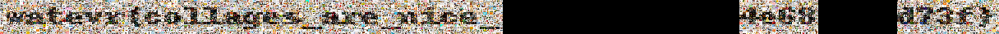
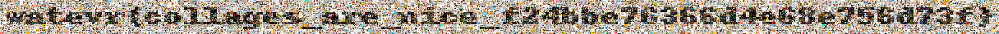

# Personal Photos writeup (Challenge author perspective)

This is one of the challenges I enjoyed making the most, and it turned out to be a cool forensics challenge in my opinion. Here is the intended solution:

When we unzip the zip file we get 4256 different jpegs. The original dataset for these where unique results from [unsplash](https://unsplash.com) for the search query "food". The actual names of the photos are straight out of urandom and thus not relevant. There is no stego hidden in the images, they are just resized right out of unsplash. Some of the jpegs have been corrupted in different ways.

There are two parts to the solution. The intended solution to the first part is to check the EXIF metadata. if we run exiftool on any image we will see two suspicious values:

```
X Position                      : 77
Y Position                      : 2
```

These are not commonly seen values in EXIF data. I myself couldn't actually find any documentation on what X and Y Position were used for, so if you know let me know. If we do the same for other images we will notice that all images have unique (X, Y) tuples. This suggests that they should be arranged in a grid (collage), and when this is done we get the following:



(The random part of the flag is not exactly the same as it was during the ctf because of this being from a different version of the challenge, but you get the idea)

The black spots in the image are the corrupted images, so we will now need to repair them to get the flag. There are a few different techniques used to corrupt the images. I wont explain how all of them should be repaired in detail, but if you are interested in seeing how they were corrupted in the first place check out the `corrupters` class in `generate.py` in the same folder as this writeup. Each method in that class is a different corruption method. Each corruption method corrupts 4 characters of the random part of flag, or 2 bytes of data. Therefore, all images will need to be repaired in order to extract the flag. Technically, you could manage to find the flag without solving one of the corruption methods by brute forcing a maximum of 65536 flags against the ctf platform, however this is against the rules and would result in disqualification of the team. When you repair all images you get the following collage:



Because of a small bug in the generator script the creation times of the images were not obfuscated, so an alternative solution exists to the first part of the challenge by figuring out in what order the generator script created the images.

If you want to take a look at the challenge source or my solve script, it's in the same folder as this writeup file.
